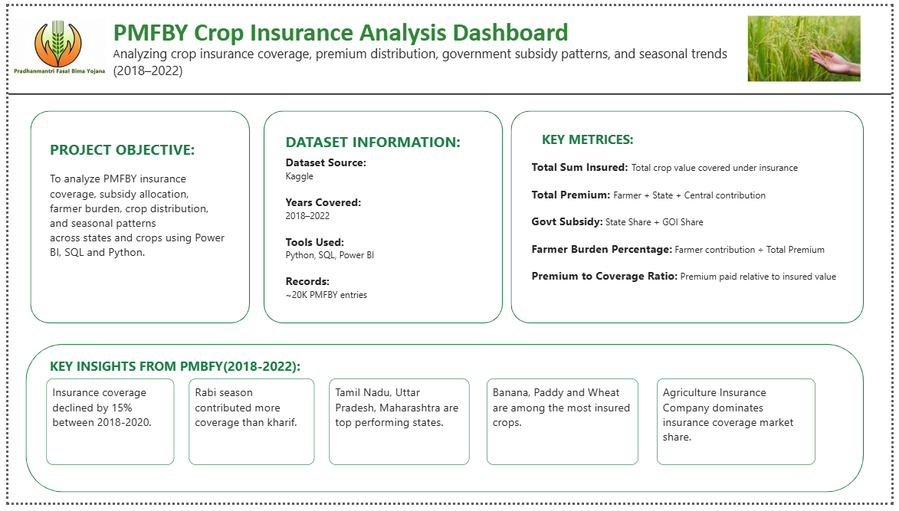
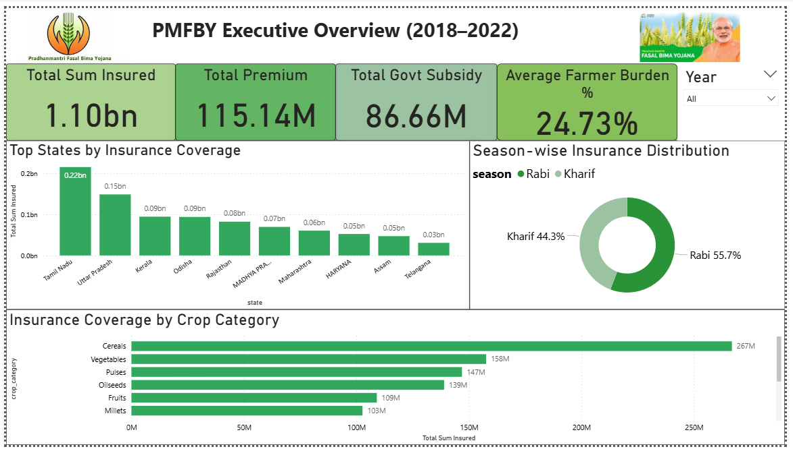
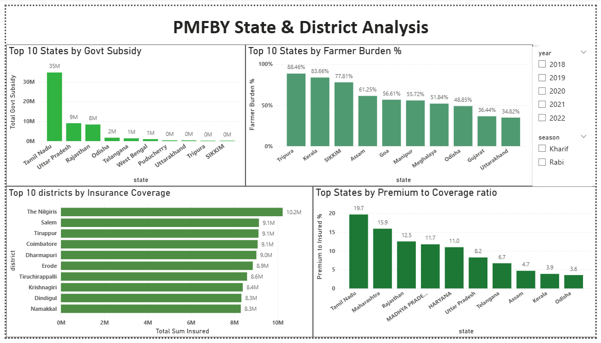
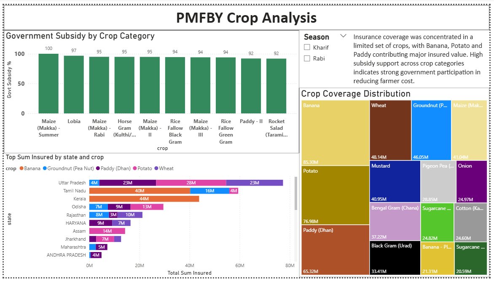
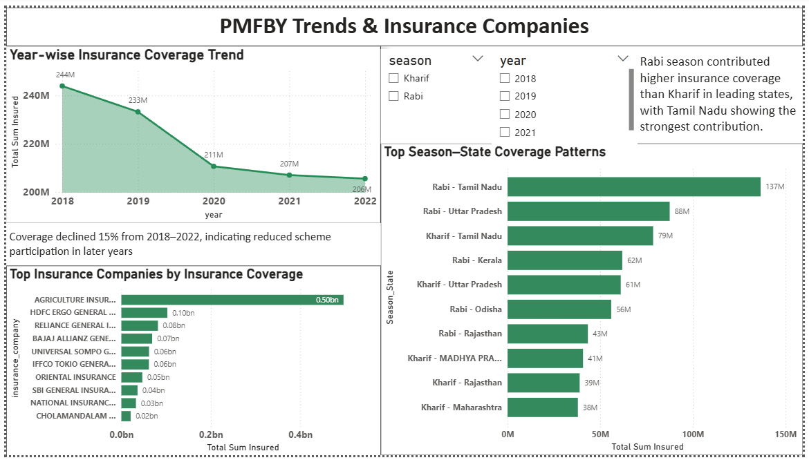

# 🌾 PMFBY Crop Insurance Analytics Project

## Project Overview
Pradhan Mantri Fasal Bima Yojana (PMFBY) is India's largest 
crop insurance scheme protecting farmers from financial losses 
due to floods, droughts, and pest attacks.

This project analyzes PMFBY coverage patterns, premium 
distribution, and government subsidy allocation across 
Indian states, crops, and seasons from 2018 to 2022.

**Personal motivation:** I come from a farming family in 
Maharashtra and have seen firsthand how crop insurance works 
at the ground level. This project connects my personal 
background with my data analytics skills.

---

## Problem Statement
Agriculture in India is highly dependent on climate and 
seasonal conditions. Although PMFBY provides crop insurance 
support, coverage and subsidy allocation are not uniform 
across all states, crops, and seasons.

**Goal:** Identify high-risk regions, analyze insurance 
patterns, and evaluate how financial support is distributed 
across India.

---

## Dataset
- **Source:** Kaggle
- **Raw records:** 29,999 rows × 62 columns
- **After cleaning:** 20,495 rows × 22 columns (PMFBY only)
- **Coverage:** 2018–2022 | 30+ states | 100+ crops

---

## Tools & Technologies
| Tool | Purpose |
|------|---------|
| Python (Pandas, NumPy) | Data cleaning & transformation |
| PostgreSQL | Business question analysis (SQL) |
| Power BI (DAX) | Dashboard & visualizations |

---

## Methodology
1. **Data Cleaning** — Removed duplicates, handled nulls, 
   standardized state names, filtered PMFBY-only records
2. **Feature Engineering** — Created total_premium, 
   total_subsidy, govt_subsidy_pct, premium_to_insured_pct
3. **SQL Analysis** — 12 business questions from basic 
   to advanced (including LAG() for YoY trends)
4. **Dashboard** — 5-page Power BI report with slicers, 
   drill-through, DAX measures

---

## Key Insights
1. 📊 **Rabi > Kharif** — Rabi season has higher insurance 
   coverage (55.7%) than Kharif (44.3%) — opposite of 
   the expected trend
2. 🏆 **Tamil Nadu dominates** — Highest sum insured AND 
   highest govt subsidy; all top 10 high-exposure 
   districts are in Tamil Nadu
3. ⚠️ **Tripura farmers most vulnerable** — Bear the 
   highest premium burden at 88.5% with minimal 
   govt support
4. 📉 **Declining coverage** — PMFBY coverage has declined 
   every year from ₹244M (2018) to ₹200M (2022), 
   indicating reduced scheme participation
5. 🏢 **Market concentration** — Agriculture Insurance 
   Company controls 45%+ of total insured value — 
   significant market dominance
6. 🌱 **Banana & Potato lead** — Not staple grains but 
   commercial crops dominate insured value nationally

---

## Dashboard Preview
## Dashboard Preview
### 1. Project Overview

### 1. Executive Overview

---

### 2. State & District Analysis

---

### 3. Crop Analysis

---

### 4. Trends & Insurance Companies

---

## Project Structure
PMFBY-Crop-Insurance-Analysis/
├── data/
│   └── PMFBY coverage.csv
├── python/
│   └── pmfby_analysis.py
├── sql/
│   └── business_questions.sql
├── dashboard/
│   └── PMFBY_Crop_Insurance_Analysis_Dashboard.pbix
└── README.md

---

---

## Author
**Khushi Duggelwar**  
📧 khushivrao61@gmail.com  
🔗 [LinkedIn](https://linkedin.com/in/khushiduggelwar)  
💻 [GitHub](https://github.com/khushiduggelwar)
